# Paw Planner App
A full-stack web application designed for pet owners to track vaccinations, medications, and veterinary appointments.
Users can register, manage pet profiles, and receive reminders for upcoming care.

- Implemented frontend with React.js and backend with Spring Boot.
- Designed and executed manual test cases to ensure smooth user flows.
- Collaborated on MySQL database design to securely store user and pet health data.
- Technologies: JavaScript, React.js, Spring Boot, MySQL, GitHub, Postman

To set up MySQL database, please follow below steps to import database dump:
1. Open MySQL Workbench and connect to your database.
2. Go to Server → Data Import.
3. Choose Import Options. Select Import from Self-Contained File and browse to the dump file.
4. Click Start Import and wait for the process to complete.

To run the frontend side, please open a new tab in the terminal, change the location to the pawplanner-frontend folder and input these commands:
npm install
npm install axios
npm run dev

## App Screenshots

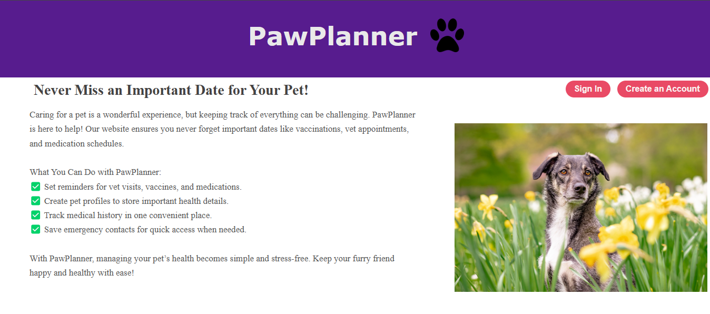
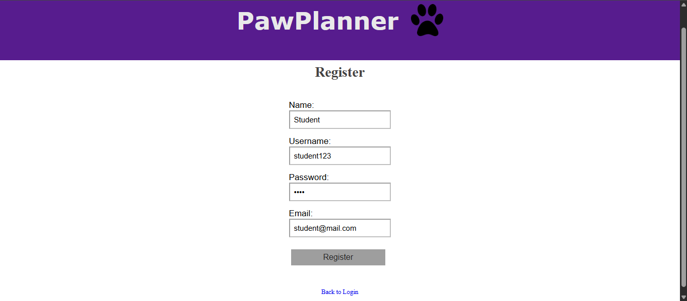
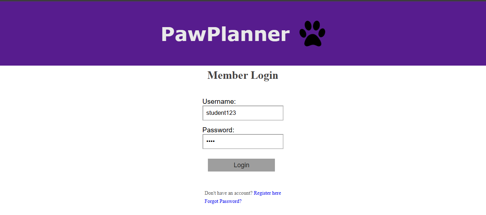
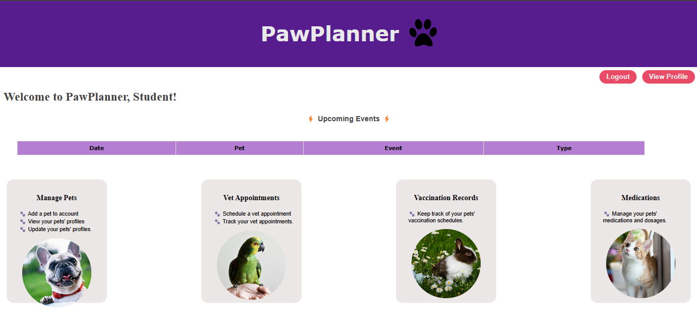
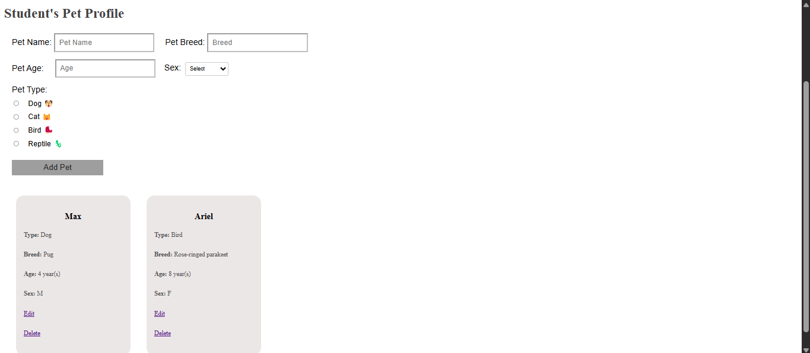
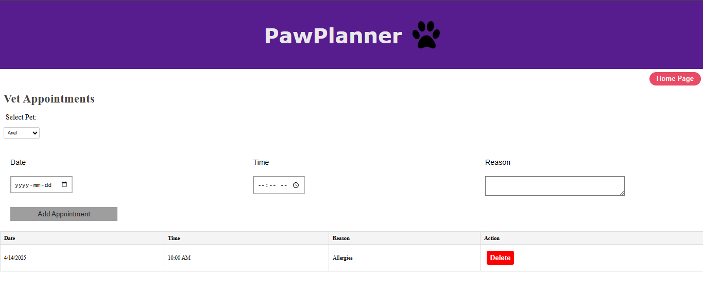
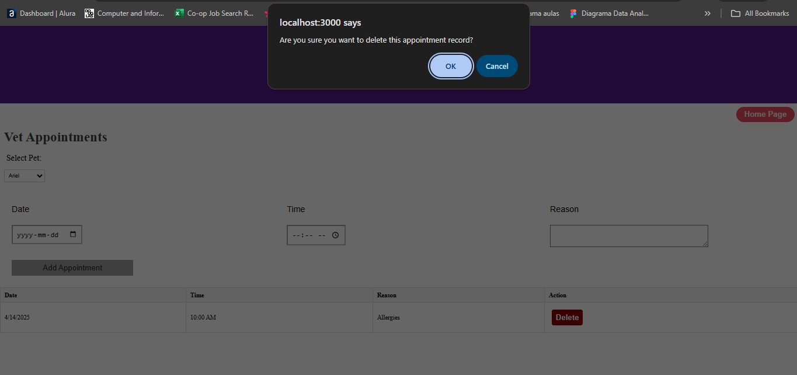
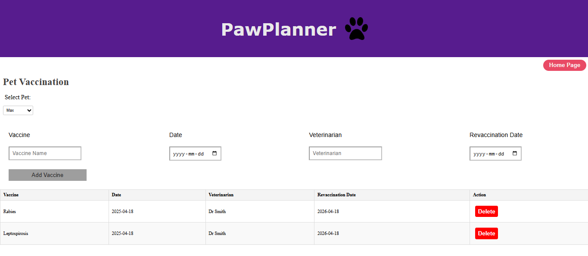
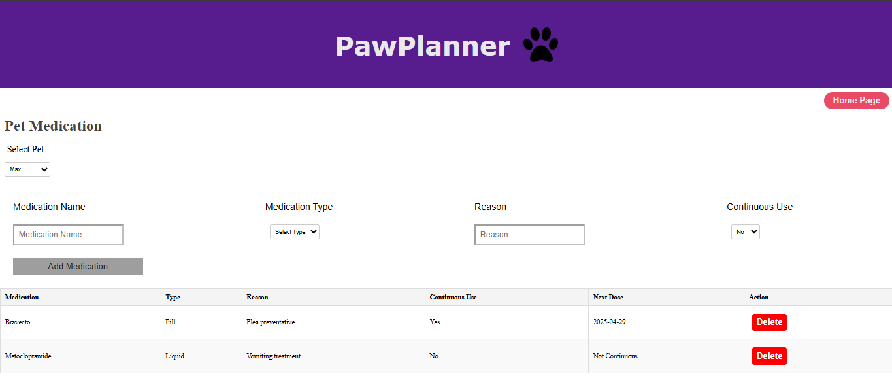
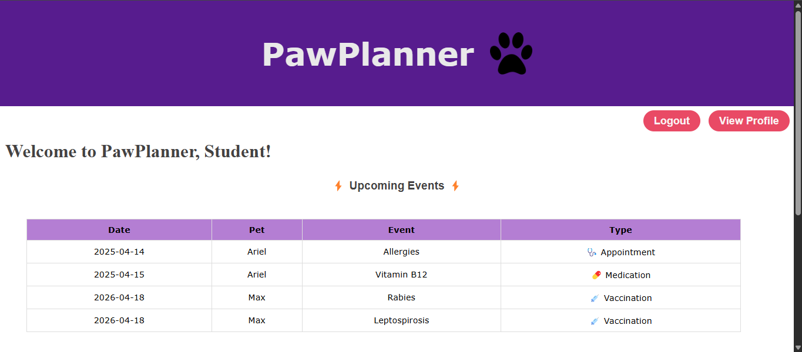
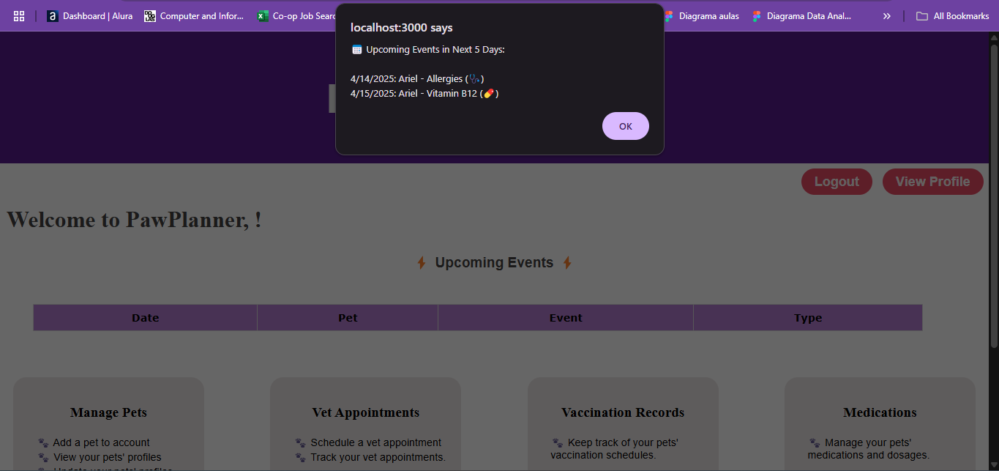
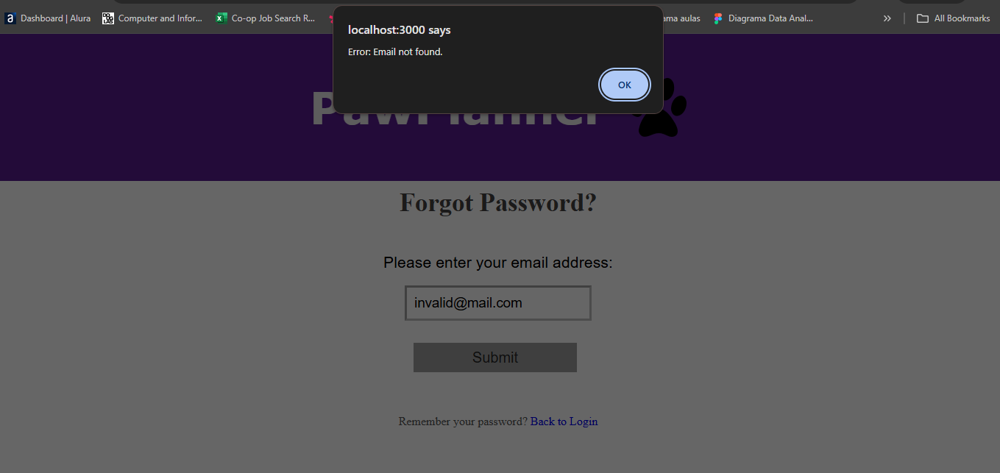
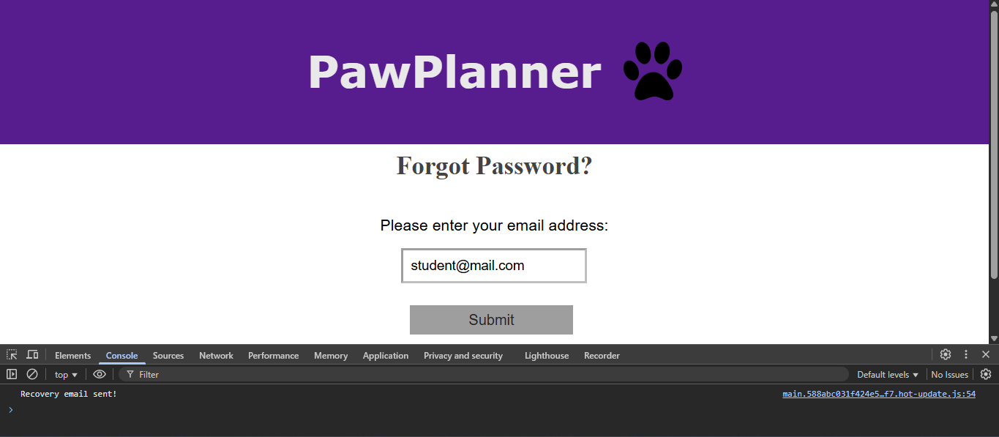
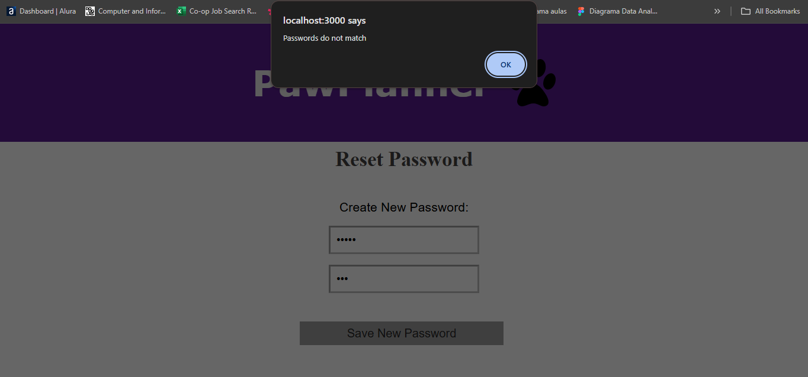
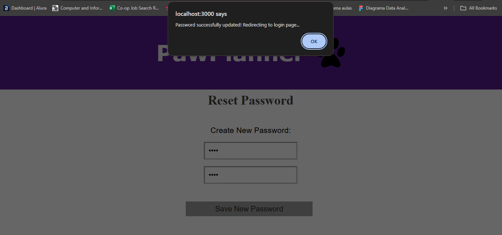
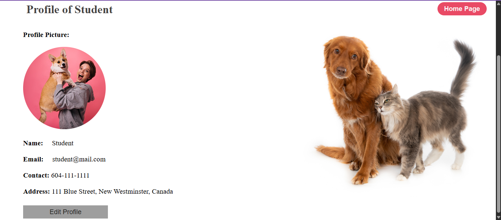
